<a href="https://sharann.dev"><picture><source media="(prefers-color-scheme: dark)" srcset="https://img.shields.io/badge/PORTFOLIO-0d1117?style=flat-square&logoColor=aaaaaa"/></picture></a>
<a href="https://sharann.dev/Resume.pdf"><picture><source media="(prefers-color-scheme: dark)" srcset="https://img.shields.io/badge/RESUME-0d1117?style=flat-square&logo=adobeacrobatreader&logoColor=aaaaaa"/></picture></a>
<a href="https://linkedin.com/in/sharannm"><picture><source media="(prefers-color-scheme: dark)" srcset="https://img.shields.io/badge/LINKEDIN-0d1117?style=flat-square&logo=linkedin&logoColor=aaaaaa"/></picture></a>
<a href="https://x.com/m_sharann"><picture><source media="(prefers-color-scheme: dark)" srcset="https://img.shields.io/badge/X-0d1117?style=flat-square"/></picture></a>
<a href="mailto:sharannmanojkumar@gmail.com"><picture><source media="(prefers-color-scheme: dark)" srcset="https://img.shields.io/badge/EMAIL-0d1117?style=flat-square"/></picture></a>

**[API Keychain](https://apikeychain.dev)** — one key for every free-tier AI provider. self-hosted LLM gateway routing across 8 inference networks behind a single OpenAI-compatible endpoint. effort-tier cascading, automatic failover, AES-256-GCM encrypted key storage, full usage analytics dashboard.
`Next.js` `FastAPI` `Python` `Supabase` `AES-256-GCM` `TypeScript` · [code](https://github.com/Sharann-del/API-Keychain)

**ProposalOS** — AI-powered RFP discovery & response platform. scrapes 11+ live procurement portals with AI fit-scoring, qualification, and submission-ready proposal generation. built at Ambian Strategy. response time: days → under two hours.
`Next.js` `FastAPI` `Python` `Supabase` · *private — built at Ambian Strategy*

**[Kern](https://kern-alpha.vercel.app/)** — a keyboard-driven personal data OS. schema-free JSONB storage, Monaco editor views, live integrations with GitHub, Notion, Calendar, and RSS. ships an MCP server so AI can interact with your personal data directly.
`React` `TypeScript` `PostgreSQL` `Supabase` `MCP` · [code](https://github.com/Sharann-del/Kern)

**[Cosmos](https://cosmos-tui.app)** — an AI chatbot that lives in your terminal. 25+ free models via OpenRouter, cloud-synced chat history across devices, file attachments, rich Markdown output. free forever, installable in one command via pip.
`Node.js` `OpenRouter` `TUI` `Supabase` · [code](https://github.com/Sharann-del/Cosmos)

**Bio-Inspired AI Hallucination Suppression** — hallucination detection pipeline for LLMs. confidence scoring → NER routing → Wikidata/Wikipedia evidence retrieval → RoBERTa NLI contradiction detection, with a blockchain audit layer. SRIP 2026 research under Dr. Sandhya P, VIT Chennai.
`Python` `Transformers` `NLP` `Blockchain` · [code](https://github.com/Sharann-del/Bio-Inspired-AI-Hallucination-Suppression)

**Landroid** — drone imagery → land intelligence. FastAPI backend ingests orthomosaic GeoTIFFs and derives NDVI-based insights, plant health zone maps, tree count estimations, and overlay PNGs. Supabase + PostGIS for spatial data.
`Flutter` `FastAPI` `Python` `Supabase` `PostGIS` · [code](https://github.com/Sharann-del/Landroid)

**Student Dashboard** — one app instead of five broken portals. unified academic platform for VIT students — attendance tracking, timetable management, and planning tools consolidating fragmented institutional systems.
`React` `Node.js` `TypeScript` `PostgreSQL` · [code](https://github.com/Sharann-del/Student-Dashboard-WP)

**Arbor** — problem-solving as a tree. every node is a task or sub-problem. recurse down, solve, backtrack — structured reasoning and AI-assisted thinking organized visually with React Flow.
`React` `TypeScript` `React Flow` `OpenAI API` · [code](https://github.com/Sharann-del/Arbor)

**NotionWidgets** — Notion databases on your home screen. native iOS app connecting to Notion databases and rendering custom home screen widgets — schedules, tasks, academic events. smart filtering, widget-first design.
`Swift` `SwiftUI` `WidgetKit` `Notion API` · [code](https://github.com/Sharann-del/NotionWidgets)

**Planner** — scheduling and focus, native. SwiftUI productivity planner — task scheduling, deadlines, prioritization, and clean visual organization for students and developers who want structure without clutter.
`Swift` `SwiftUI` `Core Data` · [code](https://github.com/Sharann-del/Planner)

**Lobe** — personal knowledge OS for the web. organize thoughts, projects, and life in one place — rich documents, databases, calendar views, and kanban boards in a single web interface.
`TypeScript` `React` `PostgreSQL` · [code](https://github.com/Sharann-del/Lobe)

**Billing System** — full-stack invoicing platform. dynamic multi-product invoices, automatic totals, JSONB-based PostgreSQL schema, JWT role-based access across admin/franchise/cashier tiers. built during the GeoPacific Solutions internship.
`Node.js` `TypeScript` `PostgreSQL` `Express` `Handlebars` · [code](https://github.com/Sharann-del/Billing-System)

**[TerminalType](https://github.com/Sharann-del/terminaltype)** — Monkeytype for your terminal. real-time WPM and accuracy tracking, instant feedback, distraction-free TUI for developers who want typing practice without leaving the CLI.
`Node.js` `JavaScript` `TUI` `CLI` · [code](https://github.com/Sharann-del/terminaltype)

**FinSight AI** — AI-powered fintech assistant. ArcNight 2026 hackathon submission built with Dhriti Vaz. financial data analysis, AI-driven insight generation, and smart portfolio intelligence for everyday users.
`Python` `Next.js` · [code](https://github.com/ragavhariharan/FinSightAI)

**Course & Module Recognition** — automated academic course identification. parses and classifies course codes, module names, and credit structures from unstructured institutional documents. handles inconsistent formatting across portals.
`Python` · [code](https://github.com/Sharann-del/Course-and-Module-Recognition)

<picture>
  <source media="(prefers-color-scheme: dark)" srcset="https://github-readme-stats.vercel.app/api?username=Sharann-del&show_icons=true&hide_border=true&bg_color=00000000&title_color=aaaaaa&text_color=777777&icon_color=888888&include_all_commits=true&count_private=true"/>
  
</picture>
<picture>
  <source media="(prefers-color-scheme: dark)" srcset="https://github-readme-stats.vercel.app/api/top-langs/?username=Sharann-del&layout=compact&hide_border=true&bg_color=00000000&title_color=aaaaaa&text_color=777777&langs_count=8"/>
  
</picture>

<picture>
  <source media="(prefers-color-scheme: dark)" srcset="https://github-readme-activity-graph.vercel.app/graph?username=Sharann-del&bg_color=00000000&color=777777&line=aaaaaa&point=aaaaaa&area_color=aaaaaa&area=true&hide_border=true&custom_title=contribution+graph"/>
  
</picture>

<!--
  all SVGs share one design system — fully adaptive via prefers-color-scheme
  say hi → sharannmanojkumar@gmail.com
-->
