 

## I — Profile

*iOS &amp; full-stack developer, working where design meets data.*

I'm **Sharann Manojkumar**, a Computer Science student at **VIT Chennai**, building across the whole stack — **SwiftUI** interfaces, **React** frontends, **PostgreSQL** schemas, and **Node.js** backends. I'm drawn to the place where design meets data: keyboard-driven personal operating systems, drone-powered land analytics, and AI terminal assistants.

Member of the **iSpace Club** web/app dev department, and an open-source contributor to [**MonkeyType**](https://github.com/monkeytypegame/monkeytype).

> *Clean architecture and how software feels to use — in equal measure.*

## II — Selected Work

*Ten projects across iOS, web, and systems.*

| Project | Year | What it is | Stack | |
|---|:---:|---|---|---|
| **01 · Kern** | 2025 | Keyboard-driven personal **data OS** — schema-free JSONB storage, Monaco editor views, and live integrations (GitHub, Notion, Calendar, Linear, RSS). Ships an **MCP server** for AI interaction with your data. | `React` `TypeScript` `PostgreSQL` `Supabase` `MCP` | [live](https://kern-alpha.vercel.app/) · [code](https://github.com/Sharann-del/Kern) |
| **02 · Cosmos** | 2025 | A full **AI chatbot in your terminal** — 25+ free models via OpenRouter, cloud-synced history across devices, file attachments, rich Markdown output. | `Node.js` `OpenRouter` `Supabase` | [live](https://cosmos-tui.app) · [code](https://github.com/Sharann-del/Cosmos) |
| **03 · Landroid** | 2025 | Land-management platform driven by **drone orthomosaic imagery (GeoTIFF)** — a FastAPI backend derives NDVI insights, plant-health zone maps, tree-count estimates and overlay PNGs. | `Flutter` `FastAPI` `Python` `Supabase` `PostGIS` | [code](https://github.com/Sharann-del/Landroid) |
| **04 · Lobe** | 2025 | Personal **knowledge OS** for the web — rich documents, databases, calendar views, kanban boards, and a full mind-map of everything you've built. | `TypeScript` `React` `PostgreSQL` | [code](https://github.com/Sharann-del/Lobe) |
| **05 · Arbor** | 2024 | Visualizes problem-solving as a hierarchical tree — each node a task or sub-problem, enabling structured reasoning and backtracking. | `React` `TypeScript` `React Flow` `OpenAI API` | [code](https://github.com/Sharann-del/Arbor) |
| **06 · Student Dashboard** | 2024 | Unified academic platform for VIT students — attendance, timetable and planning consolidated from fragmented institutional systems. | `React` `Node.js` `TypeScript` `PostgreSQL` | [code](https://github.com/Sharann-del/Student-Dashboard-WP) |
| **07 · NotionWidgets** | 2024 | Native iOS app that connects to Notion databases and renders custom home-screen widgets with smart filtering. | `Swift` `SwiftUI` `WidgetKit` `Notion API` | [code](https://github.com/Sharann-del/NotionWidgets) |
| **08 · Planner** | 2024 | Productivity-focused planner in SwiftUI — scheduling, deadlines, prioritization, and clean visual organization. | `Swift` `SwiftUI` `Core Data` | [code](https://github.com/Sharann-del/Planner) |
| **09 · Billing System** | 2025 | Full-stack billing &amp; invoicing — dynamic multi-product invoices, automatic totals, and reusable templates. | `Node.js` `TypeScript` `PostgreSQL` `Handlebars` | [code](https://github.com/Sharann-del/Billing-System) |
| **10 · terminaltype** | — | Terminal-based typing test inspired by MonkeyType — real-time WPM and accuracy in a clean TUI. | `JavaScript` `TUI` | [code](https://github.com/Sharann-del/terminaltype) |

## III — Experience

**GeoPacific Solutions** — *Billing System Developer Intern*
 CHENNAI, INDIA &#160;·&#160; MAR 2025 – JUL 2025

Built a full-stack billing and inventory platform from scratch, with a focus on scalable architecture and flexible storage.

- Designed a **JSONB-based PostgreSQL schema** for flexible product storage and dynamic invoice generation, reducing schema-migration overhead.
- Built **role-based access (JWT)** across admin / franchise / cashier workflows with fine-grained permissions.
- Shipped **RESTful APIs** in Node.js + Express — invoice lifecycle, inventory, and reporting endpoints.
- Kept a **TypeScript-first** codebase for type safety across every model and API contract.

## IV — Toolkit

*The tools behind the work.*

| Domain | Tools |
|---|---|
| **Languages**   typed, compiled &amp; scripted |       |
| **Mobile**   native iOS &amp; cross-platform |     |
| **Web &amp; Full-Stack**   frontend to API |       |
| **Data &amp; Backend**   schemas, storage &amp; spatial |        |
| **AI &amp; Systems**   models, agents &amp; MCP |     |
| **Tooling**   ship &amp; collaborate |      |

## V — Index

*Find me here.*

&#160;&#160; **Portfolio** &#160;·&#160; [sharann.dev](https://sharann.dev) &#160;&#160;|&#160;&#160; **GitHub** &#160;·&#160; [@Sharann-del](https://github.com/Sharann-del) &#160;&#160;|&#160;&#160; **LinkedIn** &#160;·&#160; [sharannm](https://linkedin.com/in/sharannm) &#160;&#160;|&#160;&#160; **X** &#160;·&#160; [@m_sharann](https://x.com/m_sharann) &#160;&#160;|&#160;&#160; **Email** &#160;·&#160; [sharannmanojkumar@gmail.com](mailto:sharannmanojkumar@gmail.com)

 
SHARANN MANOJKUMAR &#160;·&#160; CHENNAI, INDIA &#160;·&#160; OPEN TO INTERNSHIPS, FREELANCE &amp; COLLABORATION

